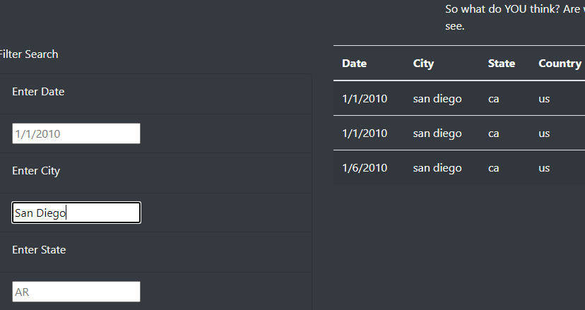
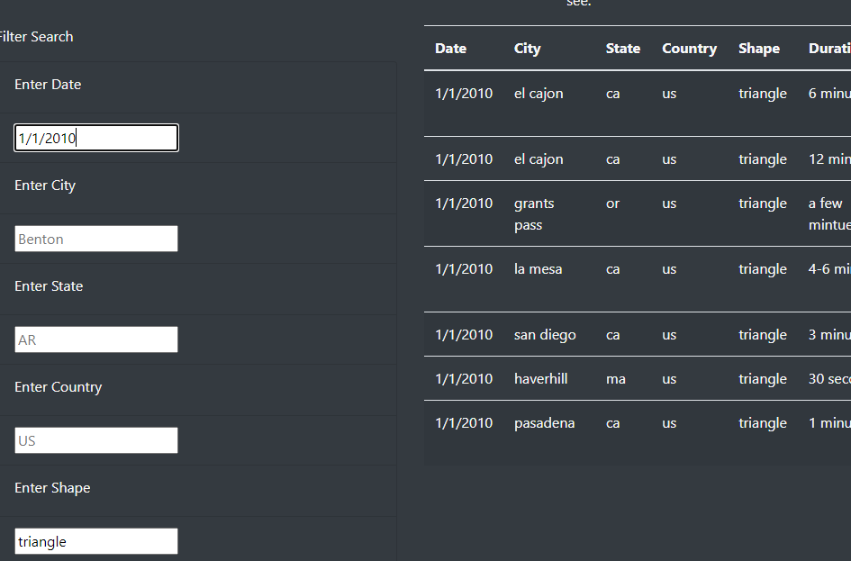
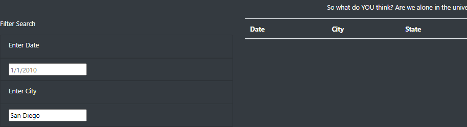

# UFO Sightings: Fact or Fancy

## Overview of Project:

The purpose of the project was to create a filterable repository of sighting data that was easy to use, visually appealing, and dynamically interactive. The initial version of the site had limited ability to filter the data solely on date and also required that the user click a button to filter the results. The goal of the final version was to include the ability to filter on 5 distinct columns and have the data update immediately upon entering filter criteria. Finally, the site was to be published to github and fully functional.

## Results:

An enthusiast of the subject matter will find utilizing the site is very friendly and responsive. Entering search criteria is as simple as just entering something into one of the filter text boxes with immediate results upon entering data in the field and either hitting enter or left clicking on another field they wish to filter by. With the provided search fields a user can filter by any number or all of the different search criteria. This will allow users to review the details of the sighting to identify patterns in date, location, shape, and duration and review comments for each incident. Using the available data and filters it's easy to review information from a specific city and broadly view the sightings as in this example citing reports from San Diego.



Another example of use would be to filter by shape to see if there are any correlations in the results on a particular date and the observations of people reporting these events.



## Summary:

There are several drawbacks, at least one of which I corrected already in the code. The most obvious issue is that in the initial project the data is case sensitive. Entering San Diego would display no results in the data utilizing the initial method.



However with some slight refactoring of the code that was easily corrected:

```
      filteredElement = filteredElement.toLowerCase();
```
Using this method, all user input is converted to lower case before being utilized to filter the base data. The difference is noticeable when compared to the image above in the Results section.

Additionally, I would make further slight cosmetic adjustments and include a message if the filter returned no results. Otherwise it would be easy to see no results and assume that the filter failed for some reason. Another important feature of a site like this would be able to report sightings that could then be appended to existing data or added to a repository for review before being added to the dataset.
